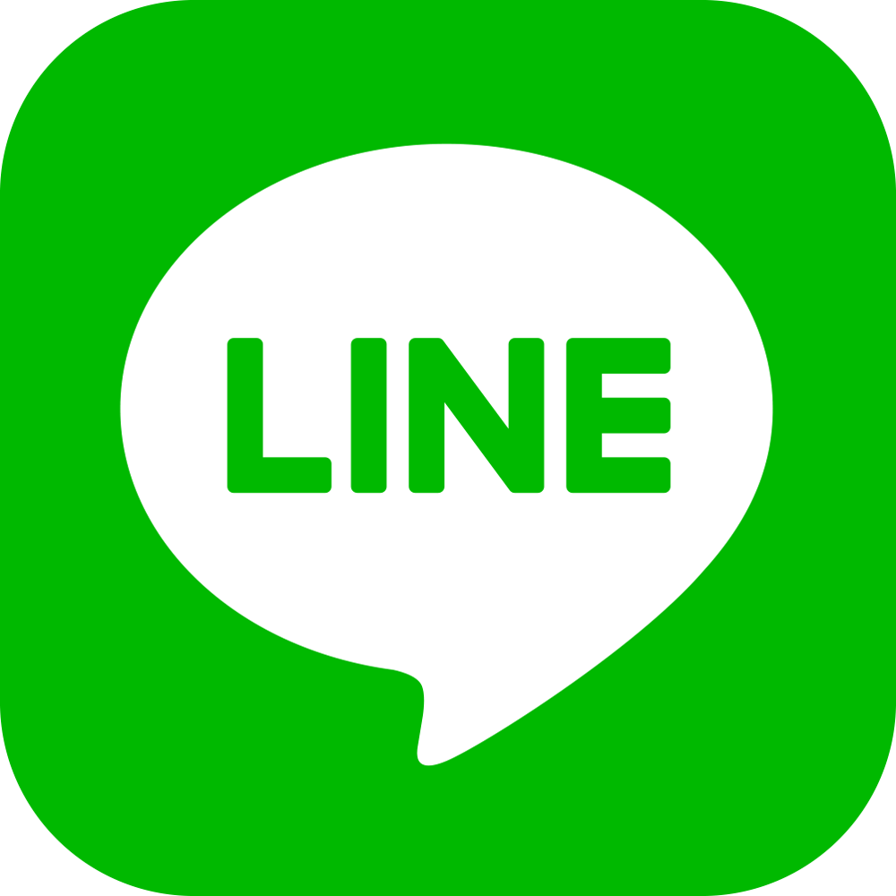

## Resources & Licenses Used
- https://whatsappbrand.com/

- https://about.google/brand-resource-center/brand-elements/

- https://brand.linkedin.com/downloads

- https://en.instagram-brand.com/

- https://line.me/en/logo

- https://en.wikipedia.org/wiki/HTML5#/media/File:HTML5_logo_and_wordmark.svg

- https://en.wikipedia.org/wiki/CSS#/media/File:CSS3_logo_and_wordmark.svg

- https://github.com/voodootikigod/logo.js/blob/master/LICENSE

- https://github.com/jquery

- https://icons.getbootstrap.com/icons/bootstrap-fill/

- https://github.com/vuejs/art

- https://www.php.net/download-logos.php

